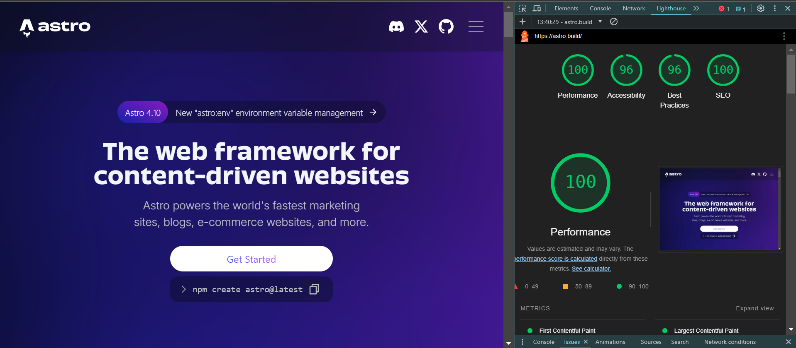

- [LightHouse: Mesure your website performance](#lighthouse-mesure-your-website-performance)
  - [Installation](#installation)
  - [Explanation](#explanation)
    - [Performance](#performance)
    - [Accessibility](#accessibility)
    - [Best practices](#best-practices)
    - [SEO (Search engine optimisation)](#seo-search-engine-optimisation)
    - [Complement](#complement)
  - [Sources](#sources)

<a id="lighthouse-mesure-your-website-performance"></a>

# .png)LightHouse: Mesure your website performance

If your website is slow, you will lose your visitors. This is a fact. But the speed or performance of a website is a very tricky and a relative subject. That's why Google put at disposition of developers a tool called *Lighthouse*. It is the subject of my article.

Google LightHouse is a very comprehensive application that will help you not only measure and analyze performance but also pinpoint exactly what is going wrong and how to correct it for a better performance.

<p align="center">
<image src="./images/lighthouse-logo-3c45f51ca8cfc.svg" />
</p>

<a id="installation"></a>

## Installation

Since it is a chrome extension, you need to install it.

- Visit the following link : [Google lighthouse chrome extension](https://chromewebstore.google.com/detail/lighthouse/blipmdconlkpinefehnmjammfjpmpbjk?hl=fr)
- Once done, you can simply open the chrome devtools with `Inspect` or `Ctrl+Shift+I`
- Run an audit. Lighthouse will check for four (4) points about the site :

  - **Performance**
  - **Accessibility**
  - **Best Practices**
  - **SEO (Search Engine Optimisation)**
  
<p align="center">
<image src="./images/stackoverflow-analysis.png">
</p>

<a id="explanation"></a>

## Explanation

I could go and explain each of them in detail but it is a topic for another day.

<a id="performance"></a>

### Performance

It is measured using specific metrics :

- First Contentful Paint (FCP)

<center>  
<image src="./images/FCP.png">
</center>
FCP measures how long it takes the browser to render the first piece of DOM content after a user navigates to your page. As you can see, everything less than 1.8 seconds is very good and bad above three seconds.

- Largest Contentful Paint (LCP)

<center>  
<image src="./images/lcp.avif">
</center>
LCP measures when the largest content element in the viewport is rendered to the screen. It becomes very bad when it is above 4 seconds

- Speed Index (SI)
  
<center>  
<image src="./images/si.png">
</center>
Speed Index measures how quickly content is visually displayed during page load. Lighthouse first captures a video of the page loading in the browser and computes the visual progression between frames

- Total Blocking Time (TBT)

<center>  
<image src="./images/tbt.png">
</center>
TBT measures the total amount of time that a page is blocked from responding to user input, such as mouse clicks, screen taps, or keyboard presses. The sum is calculated by adding the blocking portion of all long tasks between <b>First Contentful Paint</b> and Time to Interactive.

The TBT can be influenced negatively by scripts that block the rendering of the page. For example, if you take a `for`  loop from 1 to 1_000_000_000, it will take some time to finish, and uselessly block the rendering

``` typescript
    for(let i  = 0; i < 1000000000; i++ ){
        // Even if you do nothing here
    }
```

A solution to those kind of problems will be mentioned at the end of article.

- Cumulative Layout Shift (CLS)
  
<center>
<image src="./images/cls.png">
</center>

CLS is a measure of the largest burst of layout shift scores for every unexpected layout shift that occurs during the entire lifecycle of a page.

A layout shift occurs any time a visible element changes its position from one rendered frame to the next.

In my experience, especially with the NEXT JS Framework, layout shift happens commonly with images. So when you want to add images, it is recommanded to use their built-in ```<Image />``` component, that forces you to precise the height and the width of the image you want to load. Even if you don't know them exactly, these values help the browser to know how many space it needs to reserve to the images.  

If you are not using a framework like Next, it still is a good thing to precise explicitly the height and the width of the image. And with that I can transit on the accessibility parameter of lightHouse

<a id="accessibility"></a>

### Accessibility

Accessibility is a super complex topic I don't want to go in too deeper. But I can say that it is a concept assuring that your website can be used everywhere, especially screen readers. You need to make that images have ```alt``` attribute, buttons have ```aria-label```, so the people using a screen reader can know the role of some elements in your HTML markup. It barely scratches the surface of accessibility. For a more detailed description of accessibility according to Lighthouse, I put the following link  : [accessibility](https://developer.chrome.com/docs/lighthouse/accessibility/scoring)

<a id="best-practices"></a>

### Best practices

That section will pull the best practices that you didn't respected or need to respect in order to improve your score.

- Page lacks the HTML doctype, thus triggering quirks mode
- Browser errors were logged to the console
- Displays images with incorrect aspect ratio (this one specifically is a real pain)
- and so on...

<a id="seo-search-engine-optimisation"></a>

### SEO (Search engine optimisation)

The goal here is to ensure that the [**meta description**](https://developer.chrome.com/docs/lighthouse/seo/meta-description) of the page is readable by bots. This element is the main cause of javascript framework rendering paradigms we know today: Server Side Rendering, Static Site Generation, ...

<a id="complement"></a>

### Complement

I've mentioned solution for blocking scripts. There is a tool called party town. That will isolate these expensive calculations and do them asynchronously: [party Town](https://partytown.builder.io/). To go further there is also [unlighthouse](https://unlighthouse.dev/) that allows you to make lighthouse audit on every single page, it is especially useful when there is many pages. In combination to Lighthouse, take a peek to the extension [Core web Vitals](https://chromewebstore.google.com/detail/web-vitals/ahfhijdlegdabablpippeagghigmibma).

That is everything. Here is a lighthouse audit of a framework site, I need to share with you because it is one the website that have a very good score. Is the [Astro](https://astro.build/) framework.

<center></center>

## Sources

- [Chrome Lighthouse](https://developer.chrome.com/docs/lighthouse)
- [SEO for developers](https://www.youtube.com/watch?v=-B58GgsehKQ&t=627s)
- [The ultimate guide to web performance](https://www.youtube.com/watch?v=0fONene3OIA)
