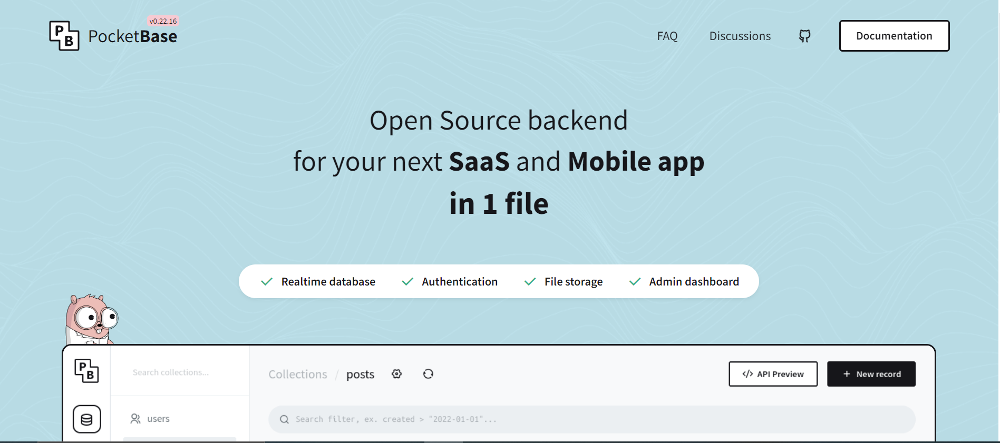
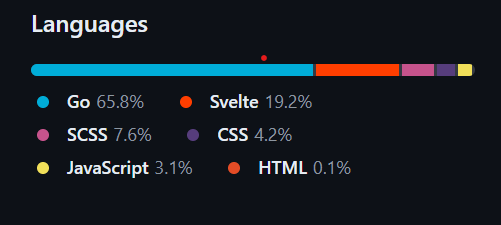

- [Pocketbase, the ultimate side projects database](#pocketbase-the-ultimate-side-projects-database)
  - [Presentation](#presentation)
  - [Installation](#installation)
  - [Features](#features)
  - [Downsides](#downsides)
  - [Conclusion](#conclusion)
  - [Sources](#sources)

# Pocketbase, the ultimate side projects database

As developers, we need to do a lot of side projects not only for ourselves or to improve our coding skills but also for many other reasons like landing a job. And for that, it is very important to choose the best database depending of the project and its scalability. There is plenty options such as **MySQL**, **PostGreSQL**, **MongoDB**,... Those are the most popular. What if I say you that there is database that is specially designed for your side projects, and if they don't fail, it is scalable ?

Allow me to introduce you to *pocketbase*: the ultimate database for these kind of projects. As we can see, it is composed of the words "pocket"(in french, poche) and "base". So in french it is something like "la base de données de poche", I suppose😅.

 

## Presentation

 Pocketbase is an open source database under the MIT License. It is written in Go and use Svelte as frontend framework. Its is based on the **SQLite** database

 

## Installation

To install it, you simply need to download the zip in the root of your project via the link : [install pocketbase](https://pocketbase.io/docs). After simply unzip it.

## Features

 It has many features that you dream at such as :

- real time database
- authentication
- file storage
- a good extensibility
- admin dashboard
- quick integration with your favorite framework: React, Angular, Flutter, Svelte, Vue

By extensibility, I mean that you can extend it with either GoLang or JavaScript. The code will be directly added in the executable of the database.

## Downsides

The downside with pocketbase is that you need to self host it on your own server. And it is not that much recommanded for production (by the docs), but that's ideal for your side projects. I want to give it a try on my next project. So I can try alternatives and compare to the big we know such as **postgres** or **mongodb**. And weight the pros and cons of such a db.

## Conclusion

If you're interested in learning more about pocketbase, here is the link to their [docs](https://pocketbase.io/docs/). And if you're interested in new and futuristic databases, I have a video from Fireship that fits your needs : [15 futuristic databases you’ve never heard of](https://www.youtube.com/watch?v=jb2AvF8XzII&t=448s).

## Sources

- [Pocketbase docs](https://pocketbase.io/docs/)
- [PocketBase... The Ultimate Side-Hustle Backend?](https://www.youtube.com/watch?v=Wqy3PBEglXQ)
